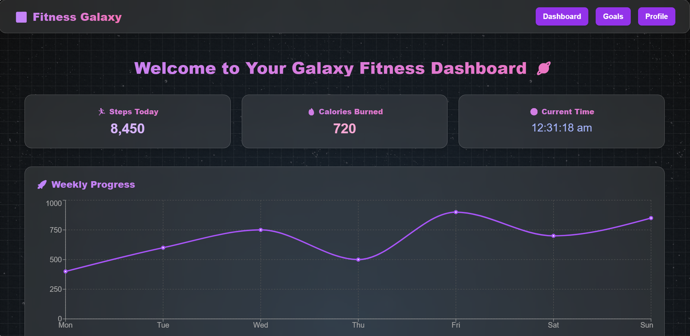

# 💪 **CodeClauseInternship_FitnessTrackerDashboard**

A **modern, animated, and galaxy-themed Fitness Tracker Dashboard** built during my **CodeClause Web Development Internship (October 2025)**.  
This project focuses on **tracking fitness activities**, **visualizing progress**, and **creating an engaging futuristic user experience**.

---

## 🏷️ **Project Information**

- **👨‍💻 Project ID:** #CC9876  
- **📌 Project Title:** Fitness Tracker Dashboard  
- **🏢 Internship Domain:** Web Development Intern  
- **🎯 Project Level:** Intermediate  
- **🧾 Assigned By:** CodeClause Internship  
- **👤 Assigned To:** Austin S  
- **🗓️ Duration:** 01 October 2025 – 31 October 2025  

---

## 🚀 **Project Aim**

**Build a comprehensive fitness tracker dashboard** that allows users to monitor their daily activities, analyze statistics, and receive workout recommendations.

---

## 💡 **Project Description**

This **Fitness Tracker Web App** enables users to:
- 🏋️‍♂️ Log and manage fitness activities  
- 📊 View real-time statistics and performance charts  
- 🤖 Receive AI-driven workout recommendations  
- 🌌 Experience a futuristic galaxy-inspired UI with moving stars and smooth animations  
- 📱 Enjoy a fully responsive interface across devices  

---

## 🧠 **What I Learned**

- ⚛️ Deep understanding of **React.js**, **Hooks**, and **Component Lifecycle**  
- 🎨 Styling with **Tailwind CSS** and **Framer Motion Animations**  
- 🔗 API integration and data fetching using **Axios**  
- 📈 **Data Visualization** through modern libraries and chart frameworks  
- 💻 Hands-on experience in **frontend architecture and UI/UX optimization**

---

## 🛠️ **Technologies Used**

- **Frontend:** React.js, Tailwind CSS, Framer Motion  
- **Backend:** Node.js, Express.js, MongoDB *(optional)*  
- **Data Visualization:** Chart.js / Recharts  
- **Version Control:** Git & GitHub  

---

## 🪐 **UI Highlights**

- 🌌 Animated **Galaxy Background** with moving stars  
- 💫 Smooth **page transitions and hover effects**  
- 📉 Interactive **charts for progress tracking**  
- 🎨 Clean, futuristic **dashboard layout**  

---

## 🖼️ **Preview**

---

## 👨‍💻 **Author**

**Austin S**  
📧 [austin.150807@gmail.com]  
🔗 [GitHub Profile]([https://github.com/Austin-150807])  
💼 **CodeClause Internship – Web Development Intern (October 2025)**  

---
